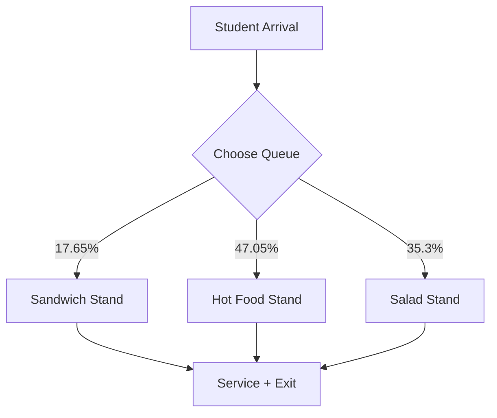
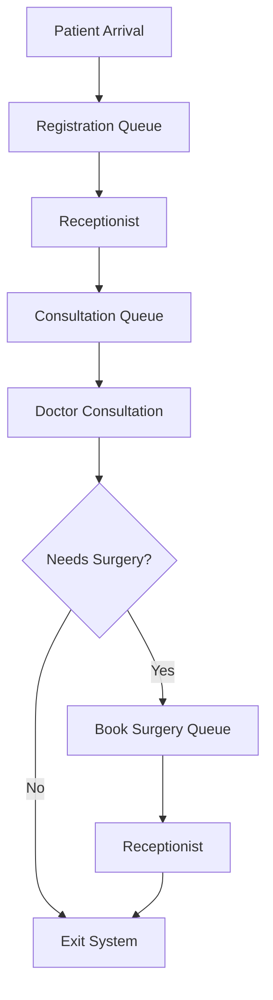

# Discrete Event Simulations in Python

This repository contains two discrete-event simulation projects built using **SimPy** in Python:

1. **🍽️Cafeteria Simulation** – models students arriving at a cafeteria and choosing between different food stands.  
2. **🏥Hospital Simulation** – models patient and call arrivals at a hospital, with resources such as receptionists and doctors.  

Both simulations showcase how queues, service times, and random arrivals can be modeled using `simpy`.

## 🥗 1. Cafeteria Simulation

### 🎯 Objective
To model how students arrive at a cafeteria and queue for service at different stands (salad, hot food, sandwiches). The goal is to estimate **average waiting times in queues** for each stand.

### 🏗️ Environment & Entities
- **Environment**: SimPy simulation clock (`env`) running for 120 minutes.  
- **Resources**:  
  - `stand_salad` (capacity = 2 servers)  
  - `stand_food` (capacity = 4 servers)  
  - `stand_sandwich` (capacity = 1 server)  
- **Students**: Arrive based on an exponential distribution (`mean_arrival = 0.4 minutes`).  
- **Queues**: Separate queues for salad, food, and sandwiches are tracked.

### 🔄 Process
1. Students arrive following a Poisson process.  
2. Each student randomly chooses a stand with defined probabilities:  
   - 🥪 Sandwich stand: ~17.65%  
   - 🍲 Hot food stand: ~47.05%  
   - 🥗 Salad stand: ~35.3%  
3. Waiting times in queues are recorded.  
4. At the end, **mean waiting times per stand** are reported.

### 📊 Example Output
```
Student 15 queued for sandwich 1.23 minutes
Student 34 queued for food 0.45 minutes
...

Mean salad queue: 0.65
Mean food queue: 0.78
Mean sandwich queue: 1.12
```

### 🖼️ Flow Diagram


---

## 🏥 2. Hospital Discrete Simulation

### 🎯 Objective
To simulate patient arrivals and calls at a hospital, measuring waiting times in queues for registration, consultation, surgery booking, and total time in the system.

### 🏗️ Environment & Entities
- **Environment**: SimPy simulation clock (`env`) running multiple replications.  
- **Resources**:  
  - `receptionist` (capacity = 1)  
  - `doctor` (capacity = 2)  
- **Patients**: Arrive based on an exponential distribution (`mean_arrival = 3 minutes`).  
- **Calls**: Incoming calls also queue for the receptionist (`mean_call = 10 minutes`).  

### 🧑‍⚕️ Patient Flow
1. **Registration** with a receptionist.  
2. **Consultation** with a doctor.  
3. A proportion (~25%) go back to the receptionist to **book surgery**.  
4. Times in each queue and in the full system are tracked.  

### ☎️ Calls
- Calls arrive independently and compete for the receptionist resource.  
- Each call has an answering time drawn from an exponential distribution.

### 🔁 Multiple Replications
- The simulation runs **100 replications** to average results.  
- Warm-up period: 180 minutes (ignored in statistics).  
- Simulation horizon: 8 hours per replication.  

### 📊 Metrics
- Average waiting time in registration, consultation, and surgery queues.  
- Average **time in system** for patients.  
- Calls’ queue times.  
- Results are plotted in a bar chart with averages.

### 📈 Example Output
```
Mean registration queue for run 1: 0.52
Mean consultation queue for run 1: 1.43
...

Average registration queue for 100 runs: 0.61
Average consultation queue for 100 runs: 1.56
Average book surgery queue for 100 runs: 0.37
Average time in system for 100 runs: 9.42
```

### 🖼️ Flow Diagram


---

## ⚙️ Requirements

- Python 3.8+  
- Libraries:
  - `random`  (installed by default in python)
  - `simpy`  
  - `matplotlib` (for hospital simulation)  

Install dependencies:
```bash
pip install simpy matplotlib
```

---

## 💡 Key Learnings

- Use of **SimPy resources** to model queues and service points.  
- **Random arrivals & service times** modeled with exponential distributions.  
- Importance of **warm-up periods** and **replications** for statistical accuracy.  
- Tracking performance metrics for system bottlenecks.  

---
